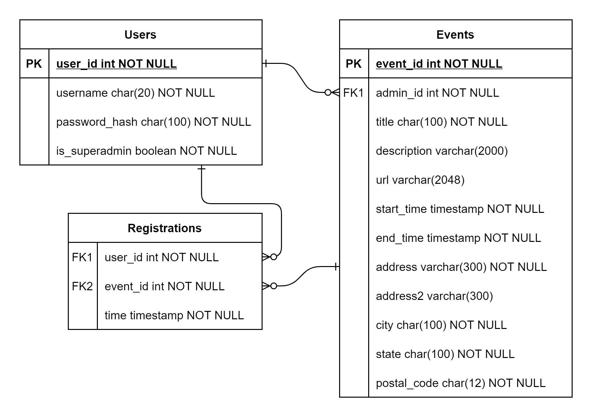

# Database Design

This document outlines the database design for this project and lists some considersations for implementation.

## Entity Relationship Diagram



## Table Creation Queries

### Database Creation

```sql
CREATE DATABASE event_portal;
```

### Users

```sql
CREATE TABLE event_portal.users (
    user_id INT NOT NULL AUTO_INCREMENT UNIQUE,
    username CHAR(20) NOT NULL UNIQUE,
    password_hash CHAR(100) NOT NULL,
    is_superadmin BOOLEAN NOT NULL,
    PRIMARY KEY (user_id)
);
```

### Events

```sql
CREATE TABLE event_portal.events (
    event_id INT NOT NULL AUTO_INCREMENT UNIQUE,
    admin_id INT NOT NULL UNIQUE,
    title CHAR(100) NOT NULL,
    description VARCHAR(2000),
    url VARCHAR(2048),
    start_time TIMESTAMP NOT NULL,
    end_time TIMESTAMP NOT NULL,
    address VARCHAR(300) NOT NULL,
    address2 VARCHAR(300),
    city CHAR(100) NOT NULL,
    state CHAR(100) NOT NULL,
    postal_code CHAR(100) NOT NULL,
    PRIMARY KEY (event_id),
    FOREIGN KEY (admin_id) REFERENCES event_portal.users(user_id)
);
```

### Registrations

```sql
CREATE TABLE event_portal.registrations (
    user_id INT NOT NULL,
    event_id INT NOT NULL,
    time TIMESTAMP NOT NULL DEFAULT CURRENT_TIMESTAMP,
    FOREIGN KEY (user_id) REFERENCES event_portal.users(user_id),
    FOREIGN KEY (event_id) REFERENCES event_portal.events(event_id)
);
```

## Considerations

- If an event or a user gets deleted, all of the registrations related to that event or user should be deleted.
- When a user creates an event, they should be automatically registered for it, for simplicity.
  - Even though this is true, the admin can still remove their regisration, so this would still be a 1 to 0 or more cardinality.
- Separating the individual parts of the address in the Events table enables searching by city, which is a requirement of the participant interface
- We should prevent users from registering for an event that has already ended.
- It would be nice to have a count of the number of people who've registered for a given event. There are a few different ways of doing this that require different update strategies.
  - One way would be to query the Registrations table every time you want to compute this number, counting the rows that match the event_id you're looking at.
  - Another way would be to store this value in the Events table in each event row. However, there are a few different conditions when you would update this value:
    - User registers for an event
    - User unregisters for an event
    - User is deleted
    - Perhaps more?
